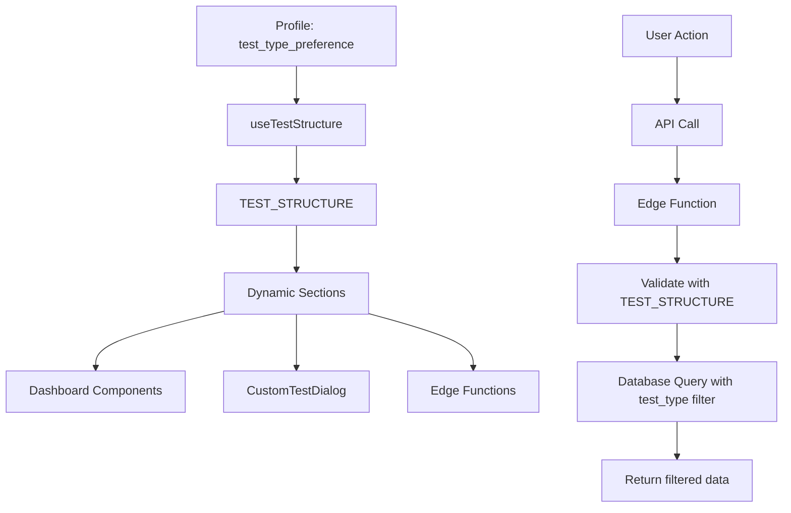

# هيكلة النظام الديناميكي - توثيق

## نظرة عامة

تم إعادة هيكلة المشروع بالكامل ليكون **ديناميكياً وموحداً**، مما يسمح بسهولة إدارة أنواع الاختبارات المختلفة (قدرات وتحصيلي) دون تكرار الكود.

---

## 🎯 الملفات الأساسية

### 1. **ملف التكوين المركزي**
📁 `src/config/testStructure.ts`

هذا الملف هو **القلب النابض** للنظام. يحتوي على جميع تعريفات الاختبارات:

```typescript
export const TEST_STRUCTURE = {
  "قدرات": {
    nameAr: "القدرات العامة",
    sections: [
      { id: "كمي", nameAr: "الكمي", icon: "🔢", topics: [...] },
      { id: "لفظي", nameAr: "اللفظي", icon: "📝", topics: [...] }
    ]
  },
  "تحصيلي": {
    nameAr: "التحصيلي",
    sections: [
      { id: "رياضيات", ... },
      { id: "فيزياء", ... },
      { id: "كيمياء", ... },
      { id: "أحياء", ... }
    ]
  }
}
```

**الفوائد:**
- ✅ مصدر واحد للحقيقة (Single Source of Truth)
- ✅ سهولة إضافة أقسام أو مواضيع جديدة
- ✅ عدم تكرار البيانات

---

### 2. **Custom Hook للوصول الديناميكي**
📁 `src/hooks/useTestStructure.tsx`

يوفر واجهة سهلة للوصول إلى هيكل الاختبار حسب تفضيلات المستخدم:

```typescript
const { 
  testType,           // نوع الاختبار الحالي
  sections,           // الأقسام المتاحة
  getTopicsForSection, // دالة لجلب المواضيع
  allTopics           // جميع المواضيع
} = useTestStructure();
```

---

### 3. **نسخة Deno للـ Edge Functions**
📁 `supabase/functions/_shared/testStructure.ts`

نسخة متطابقة من ملف التكوين للاستخدام في Supabase Edge Functions.

---

## 🔄 المكونات المحدّثة

### Dashboard (`src/pages/NewDashboard.tsx`)
- ❌ **قبل:** أقسام hardcoded لكل نوع اختبار
- ✅ **بعد:** تستخدم `useTestStructure()` لجلب الأقسام ديناميكياً

### نقاط القوة والضعف (`src/pages/WeaknessAnalysis.tsx`)
- ✅ إضافة فلترة حسب `test_type` و `track`
- ✅ إضافة Empty State عند عدم وجود بيانات
- ✅ رسائل مخصصة لكل نوع اختبار

### CustomTestDialog (`src/components/CustomTestDialog.tsx`)
- ✅ قائمة الأقسام ديناميكية من `TEST_STRUCTURE`
- ✅ يعمل مع قدرات وتحصيلي تلقائياً

### DashboardAnalytics (`src/components/DashboardAnalytics.tsx`)
- ✅ فلترة البيانات حسب `test_type`

### useWeaknessProfile (`src/hooks/useWeaknessProfile.tsx`)
- ✅ فلترة تلقائية حسب نوع الاختبار

---

## 🔧 Edge Functions المحدّثة

### `analyze-weaknesses`
```typescript
// يستقبل:
{
  userId: string,
  testType: "قدرات" | "تحصيلي",
  track?: string,
  timeRange: number
}

// يفلتر البيانات حسب test_type و track
// يعيد empty state مخصص عند عدم وجود بيانات
```

### `generate-quiz`
- ✅ يستورد `TEST_STRUCTURE` للتحقق من صحة البيانات
- ✅ يتحقق من صحة القسم والموضوع قبل التوليد

---

## 📊 مسار البيانات



---

## 🎨 كيفية إضافة نوع اختبار جديد

### قبل: ⏱️ 2-3 ساعات عمل
- تعديل 8+ ملفات
- إضافة hardcoded sections في كل مكان
- خطر نسيان أماكن

### بعد: ⏱️ 5 دقائق فقط!

**الخطوات:**

1. فتح `src/config/testStructure.ts`
2. إضافة القسم الجديد:

```typescript
export const TEST_STRUCTURE = {
  // ... الأنواع الموجودة
  "اختبار_جديد": {
    nameAr: "الاختبار الجديد",
    sections: [
      {
        id: "قسم_1",
        nameAr: "القسم الأول",
        icon: "🎯",
        topics: ["موضوع 1", "موضوع 2"]
      }
    ]
  }
}
```

3. تحديث `supabase/functions/_shared/testStructure.ts` بنفس التعديل
4. ✅ **انتهى!** جميع المكونات ستتعرف على النوع الجديد تلقائياً

---

## 🔍 نقاط مهمة للمطورين

### 1. **لا تستخدم Hardcoded Values**
```typescript
// ❌ خطأ
const sections = ["كمي", "لفظي"];

// ✅ صحيح
const { sections } = useTestStructure();
```

### 2. **استخدم الفلترة دائماً**
```typescript
// ❌ خطأ - يجلب كل البيانات
const { data } = await supabase.from("daily_exercises").select("*");

// ✅ صحيح - يفلتر حسب test_type
const { data } = await supabase
  .from("daily_exercises")
  .select("*")
  .eq("test_type", profile?.test_type_preference);
```

### 3. **تزامن ملفي testStructure**
يجب أن يكون محتوى:
- `src/config/testStructure.ts`
- `supabase/functions/_shared/testStructure.ts`

**متطابقاً تماماً** لتجنب أخطاء التحقق.

---

## 🧪 الاختبار

### اختبار كمستخدم قدرات:
1. تسجيل دخول
2. التأكد من ظهور قسمين فقط (كمي، لفظي)
3. محاولة إنشاء اختبار مخصص
4. التأكد من عمل نقاط القوة والضعف

### اختبار كمستخدم تحصيلي:
1. تغيير `test_type_preference` إلى "تحصيلي"
2. التأكد من ظهور 4 أقسام (رياضيات، فيزياء، كيمياء، أحياء)
3. إكمال بعض التمارين
4. التحقق من تحديث صفحة التحليل

---

## 📈 المزايا المحققة

| المقياس | قبل | بعد |
|---------|-----|-----|
| **Hardcoded Sections** | في 8+ ملفات | ملف واحد فقط |
| **Dashboard** | ثابت لكل نوع | ديناميكي 100% |
| **نقاط القوة والضعف** | لا تعمل للتحصيلي | تعمل لجميع الأنواع |
| **وقت إضافة نوع جديد** | 2-3 ساعات | 5 دقائق |
| **Maintainability** | 🔴 صعب | 🟢 سهل جداً |
| **Bugs** | 🔴 عالي | 🟢 منخفض |

---

## 🚀 التحسينات المستقبلية المقترحة

1. **تخزين TEST_STRUCTURE في Database**
   - يسمح بتحديث الأقسام دون نشر كود جديد
   
2. **لوحة تحكم إدارية**
   - إضافة/تعديل الأقسام والمواضيع من الواجهة

3. **دعم اللغات المتعددة**
   - إضافة ترجمات للأقسام والمواضيع

4. **Caching متقدم**
   - تخزين TEST_STRUCTURE في localStorage

---

## 📞 الدعم

عند مواجهة مشاكل:
1. تحقق من `test_type_preference` في profile المستخدم
2. راجع console logs في Edge Functions
3. تأكد من تزامن ملفي testStructure
4. تحقق من صحة Database queries والفلترة

---

**آخر تحديث:** 2025-11-01
**الإصدار:** 2.0.0 - النظام الديناميكي الموحد
